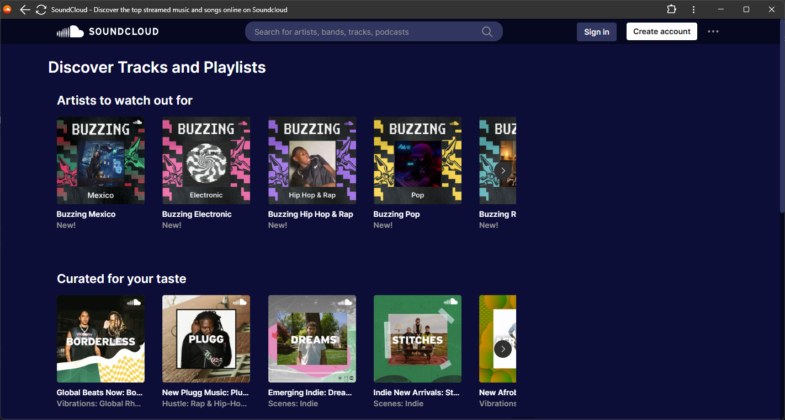

A chrome extensi"https://images8.alphacoders.com/130/thumb-1920-1305841.jpg"on providing a simple dark blue theme for [soundcloud.com](https://soundcloud.com/) written in scss. Uses [grass](https://github.com/connorskees/grass) to generate the css. This is for personal use and therefore very opinionated. For example with `display: none` on some UI elements I don't need. But feel free to use it, [releases](https://github.com/KaindlJulian/sc-theme/releases) include the zipped extension (`theme.zip`).

